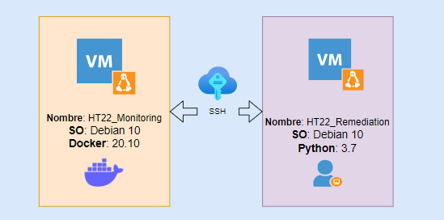

# Logicalis - Remediation Tool

[Back](P2.md) - [Home](../README.md) - [Next](P4.md)

  

# Posta 3 - Logging
## Objetivo
Para esta posta debemos escribir un código en python 'posta_3.py' que integre las postas 1 y 2 y haga un logging de tipo 'debbug' de la ejecucion y logs de tipo 'info' de: Nombre y Estado del container y salida del comando 'ls -a'.

El archivo debe generarse en 'output/log/HT22.log' dentro de 'HT22_Remediation'

> Para generar la carpeta log usamos el siguiente comando:
> ~~~bash
> mkdir $HOME/output/log
> ~~~

## Contexto
Una parte importante en cualquier proyecto de automatización es el logging, con el cual llevamos registro de ejecuciones dentro de nuestro proyecto.

> "Logging es un medio de rastrear los eventos que ocurren cuando se ejecuta algún software. El desarrollador del software agrega llamadas de registro a su código para indicar que ciertos eventos han ocurrido. Un evento se describe mediante un mensaje descriptivo que puede contener opcionalmente datos variables (es decir, datos que son potencialmente diferentes para cada ocurrencia del evento). Los eventos también tienen una importancia que el desarrollador atribuye al evento; la importancia también puede llamarse el nivel o la severidad." — [Python Doc: Logging](https://docs.python.org/es/3/howto/logging.html)

## Validación
Generar archivo 'HT22.log' con información de ejecución de nuestro script en 'output/log/HT22.log' dentro de 'HT22_Remediation'.

[Back](P2.md) - [Home](../README.md) - [Next](P4.md)
