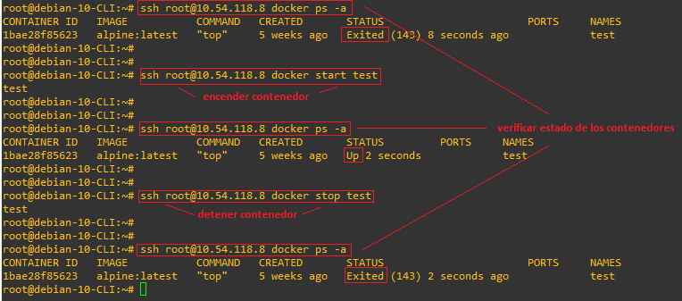

# Logicalis - Remediation Tool

[Back](P3.md) - [Home](../README.md) - [Next](P5.md)

  

# Posta 4 - Enviar comandos
## Objetivo
En esta posta debemos escribir un código en python 'posta_4.py' que primero verifique que efectivamente el contenedor se encuentre detenido en estado "exited" (ya escribimos codigo en una posta anterior para verificar esto), y si es así envie el comando **"docker start test"** hacia HT22_Monitoring a traves de nuestra conexión SSH desde **HT22_Remediation**.

Una ves que envie el comando, el codigo debe verificar nuevamente el estado del contenedor (este debe haber cambiado de "exited" a "running"), guardar el cambio de estado (si ocurrió) y el nombre del contenedor junto con el día y la hora de la remediación (UTC-3). Por último, debe mantener un logging de ejecución del código en 'output/log/HT22.log'.

## Contexto
Para esta posta vamos a ponernos en la situación de que nuestro contenedor llamado **'test'** en **HT22_Monitoring** se encuentra **"detenido"** por x motivo, lo cual es algo que nosotros como ingenieros de automatización queremos evitar a toda costa. 

> Podes probar ejecutando este comando desde la linea de comandos de debian como :
> ~~~bash
> ssh root@10.54.118.8 docker start <nombre_del_container>
> ~~~
>
> Para detener el contenedor nuevamente ejecutamos:
> ~~~bash
> ssh root@10.54.118.8 docker stop <nombre_del_container>
> ~~~ 
>
>Para verificar el estado del contenedor luego de cada comando podes ejecutar:
> ~~~bash
> ssh root@10.54.118.8 docker ps -a
> ~~~ 

  

## Validación
Guardar el cambio de estado del contenedor 'grupo_n' en un archivo output/posta_4.txt y generar archivo 'HT22.log' con información de ejecución de nuestro código.

[Back](P3.md) - [Home](../README.md) - [Next](P5.md)
