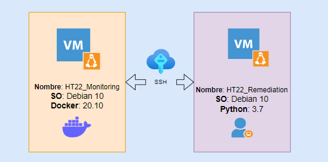

# Logicalis - Remediation Tool

[Back](P4.md) - [Home](../README.md) - [Next](P6.md)

  

# Posta 5 - Remediacion continua
Por ahora todo muy lindo y funcional... pero donde está el automatismo?

Para esta posta debemos lograr que nuestro codigo escrito en la **Posta 4** se ejecute de manera continua, sin la necesidad de que lo estemos ejecutando manualmente cada vez que se detiene un contenedor.

Esto significa que deberiamos ejecutar una sola vez en la linea de comandos de **HT22_Remediation** el comando "python3 posta5.py" y nuestro codigo deberá quedar ejecutandose de manera continua hasta que nosotros detengamos la ejecucion (por ejemplo con ctrl+c).

Otra opción al ctrl+c es mantener el proceso de ejecucion del codigo en "segundo plano", para mantener la terminar en funcionamiento. (ESTO NO ES PARTE DEL OBJETIVO DE LA POSTA)

## Objetivo
Escribir un codigo python llamado posta5.py el cual ejecute de manera continua lo realizado en la **Posta 4**

[Back](P4.md) - [Home](../README.md) - [Next](P6.md)
